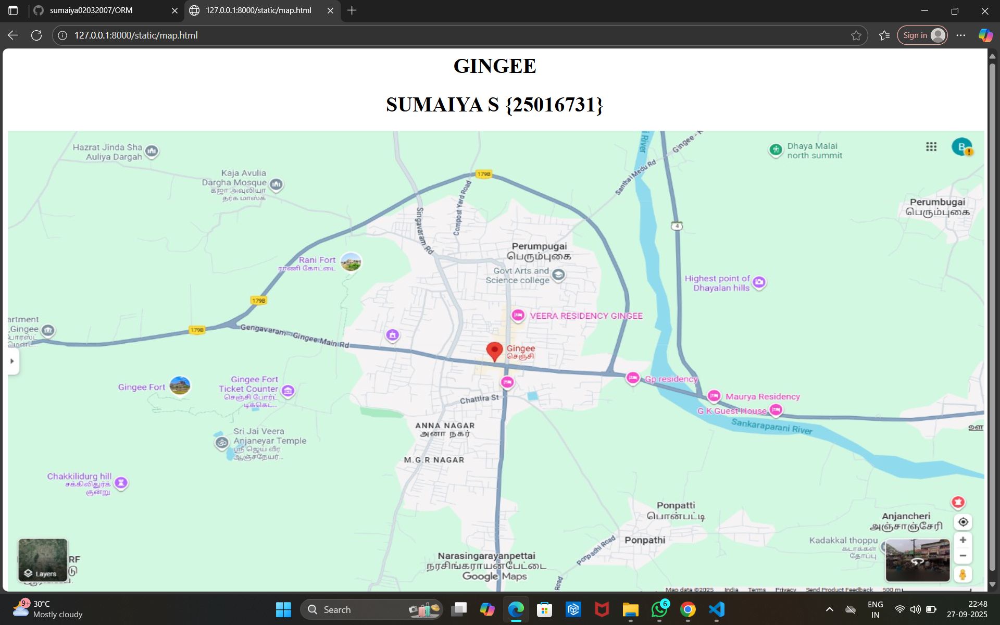
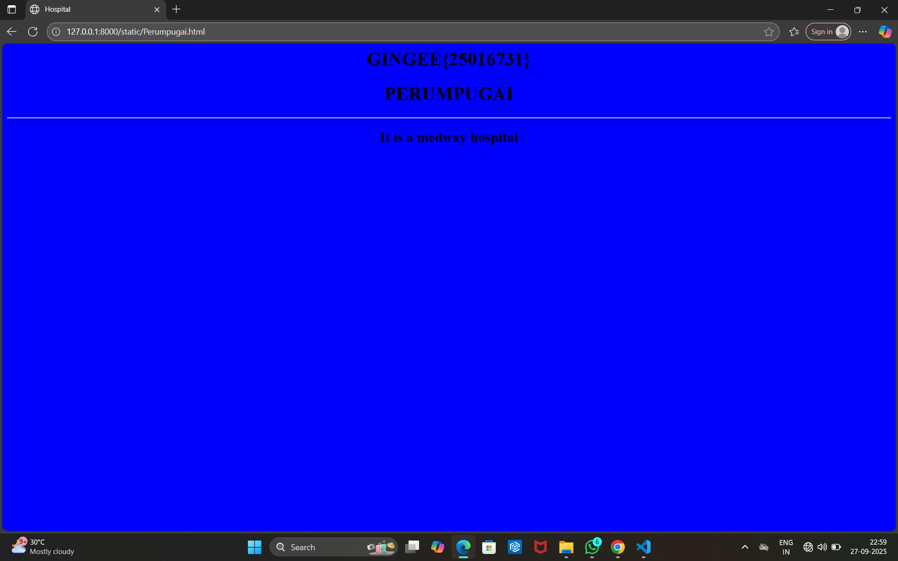
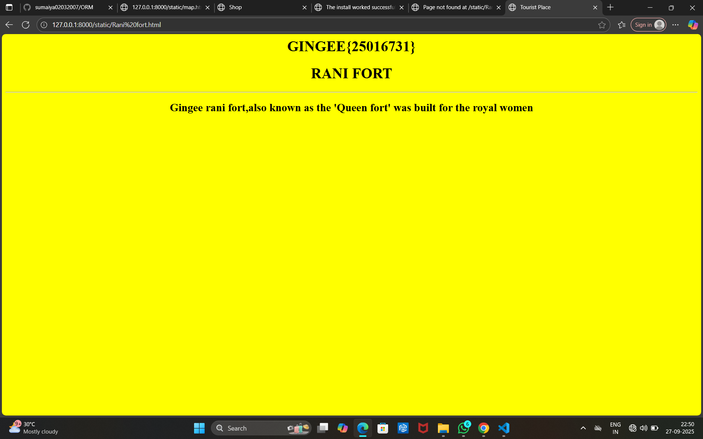
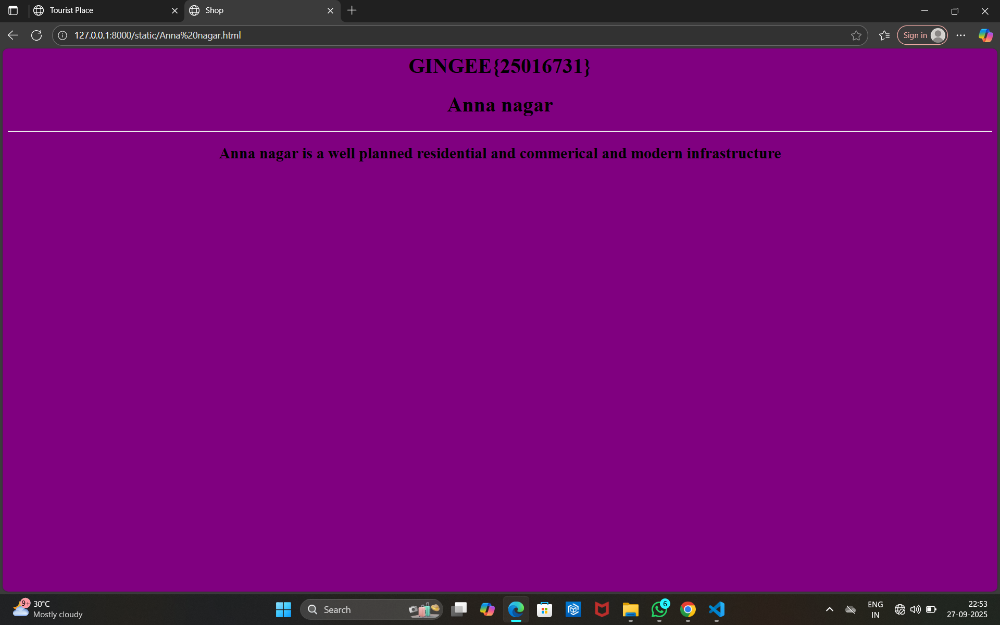
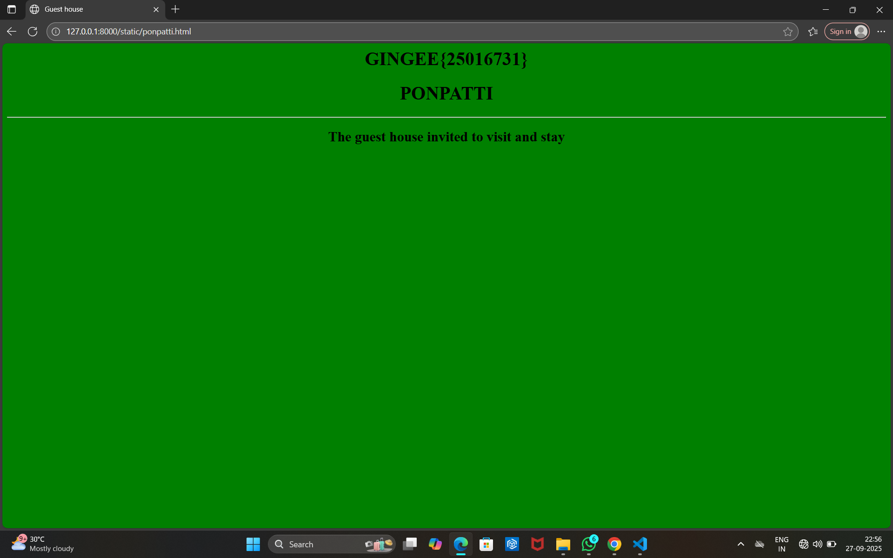
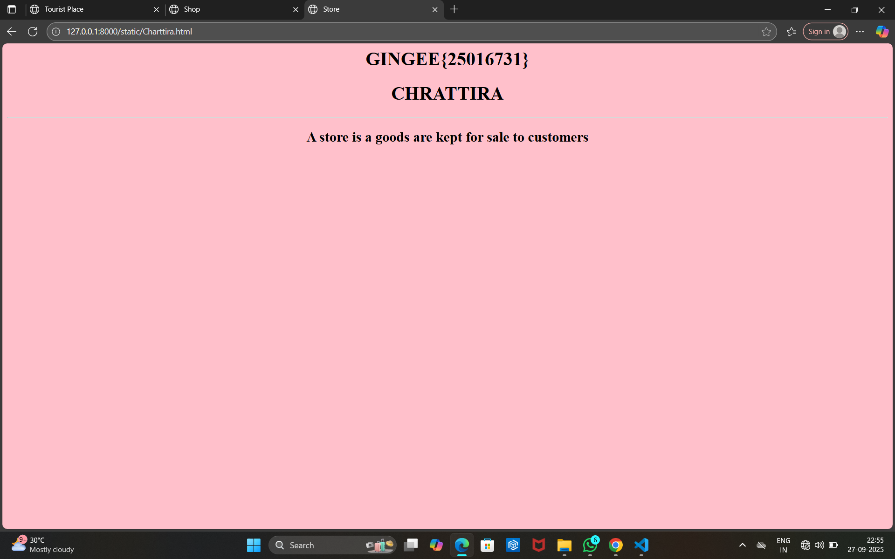

# Ex04 Places Around Me
## Date: 27.09.2025

## AIM
To develop a website to display details about the places around my house.

## DESIGN STEPS

### STEP 1
Create a Django admin interface.

### STEP 2
Download your city map from Google.

### STEP 3
Using ```<map>``` tag name the map.

### STEP 4
Create clickable regions in the image using ```<area>``` tag.

### STEP 5
Write HTML programs for all the regions identified.

### STEP 6
Execute the programs and publish them.

## CODE
```
map.html

<html>
    <head>
        <body align="center">
            <h1>GINGEE</h1>
            <h1>SUMAIYA S {25016731}</h1>
            
            <map name="image-map">
                <area target="" alt="Perumpugai" title="Hospital" href="Perumpugai.html" coords="621,504,832,585" shape="rect">
                <area target="" alt="Rani fort" title="Tourist place" href="Rani fort.html" coords="866,692,98" shape="circle">
                <area target="" alt="Anna nagar" title="Shop" href="Anna nagar.html" coords="302,693,301,776,367,809,444,809,480,764,520,726,498,668,368,659" shape="poly">
                <area target="" alt="Ponpatti" title="Guest House" href="Ponpatti.html" coords="895,337,1079,408" shape="rect">
                <area target="" alt="Chattira" title="store" href="Chattira.html" coords="124,502,77" shape="circle">
            </map>
        </body>
    </head>
</html>

Perumpaugai
<html>
    <head>
        <title>
            Hospital
        </title>
    </head>
    <body bgcolor="blue" align="center">
        <h1>GINGEE{25016731}</h1>
        <h1>PERUMPUGAI</h1>
        <hr>

        <h2>It is a medway hospital</h2>
    </body>
</html>

Rani.html
<html>
    <head>
        <title>
            Tourist Place
        </title>
    </head>
    <body bgcolor="yellow" align="center">
        <h1>GINGEE{25016731}</h1>
        <h1>RANI FORT</h1>
        <hr>

        <h2>Gingee rani fort,also known as the 'Queen fort' was built for the royal women</h2>
    </body>
</html>

Anna nagar
<html>
    <head>
        <title>
            Shop
        </title>
    </head>
    <body bgcolor="purple" align="center">
        <h1>GINGEE{25016731}</h1>
        <h1>Anna nagar</h1>
        <hr>

        <h2>Anna nagar is a well planned residential and commerical and modern infrastructure</h2>
    </body>
</html>

Ponpatti
<html>
    <head>
        <title>
            Guest house
        </title>
    </head>
    <body bgcolor="green" align="center">
        <h1>GINGEE{25016731}</h1>
        <h1>PONPATTI</h1>
        <hr>

        <h2>The guest house invited to visit and stay</h2>
    </body>
</html>

Charttira
<html>
    <head>
        <title>
            Store
        </title>
    </head>
    <body bgcolor="pink" align="center">
        <h1>GINGEE{25016731}</h1>
        <h1>CHRATTIRA</h1>
        <hr>

        <h2>A store is a goods are kept for sale to customers</h2>
    </body>
</html>

```

## OUTPUT







## RESULT
The program for implementing image maps using HTML is executed successfully.
